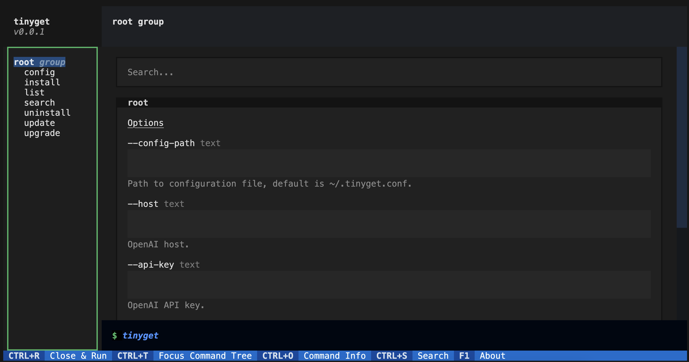

# Tinyget

## 项目介绍

这是一个 Python 的包管理工具，目前处理两个主流的系统包管理器：`apt`（使用于 Debian, Ubuntu 等），`dnf`（使用于 Fedora, CentOS 等），`pacman`（使用于 ArchLinux 等）。

这个库封装了各种包管理器的核心操作，使得对它们的操作可以通过统一的接口和格式进行。

## 安装方法

```bash
pip install git+https://gitee.com/tinylab/tinyget.git
```
更新
```bash
pip install --upgrade git+https://gitee.com/tinylab/tinyget.git
```

## 使用方法

```bash
Usage: tinyget [OPTIONS] COMMAND [ARGS]...

Options:
  --config-path TEXT  Path to configuration file, default is ~/.tinyget.conf.
  --host TEXT         OpenAI host.
  --api-key TEXT      OpenAI API key.
  --model TEXT        OpenAI model.
  --max-tokens TEXT   OpenAI max tokens.
  --help              Show this message and exit.

Commands:
  config     Interactively set up ai_helper for tinyget.
  install    Install packages.
  list       List packages.
  search     Search package.
  ui         TinyGet UI
  uninstall  Uninstall packages.
  update     Update the index of available packages.
  upgrade    Upgrade all available packages.
```

## 基本操作

使用`install`和`uninstall`命令来安装和卸载包，使用`upgrade`命令来升级所有包，使用`update`命令来更新包索引。

## 列包目录
```bash
tinyget list --help
Usage: tinyget list [OPTIONS]

  List packages.

Options:
  -I, --installed   Show only installed packages.
  -U, --upgradable  Show only upgradable packages.
  -C, --count       Show count of packages.
  --help            Show this message and exit.
```

## 配置 AI 助手
本工具提供 AI 智能助手功能，当你的命令出现错误时，它会自动为你纠错。你可以通过`config`命令来配置 AI 助手。

```bash
tinyget config --help
Usage: tinyget config [OPTIONS]

  Interactively set up ai_helper for tinyget.

Options:
  -H, --host TEXT           openai api host, default is
                            https://api.openai.com, can be specified with
                            environment variable OPENAI_API_HOST
  -K, --api-key TEXT        openai api key, can be specified with environment
                            variable OPENAI_API_KEY
  -M, --model TEXT          model to use, can be specified with environment
                            variable OPENAI_MODEL
  -C, --max-tokens INTEGER  Maximum number of tokens to be generated, default
                            is 1024, can be specified with environment
                            variable OPENAI_MAX_TOKENS, 8192 is openai's max
                            value when using gpt-3.5-turbo
  --help                    Show this message and exit.
```

## TUI 界面
使用 `tinyget ui` 命令来启动 TUI 界面。
