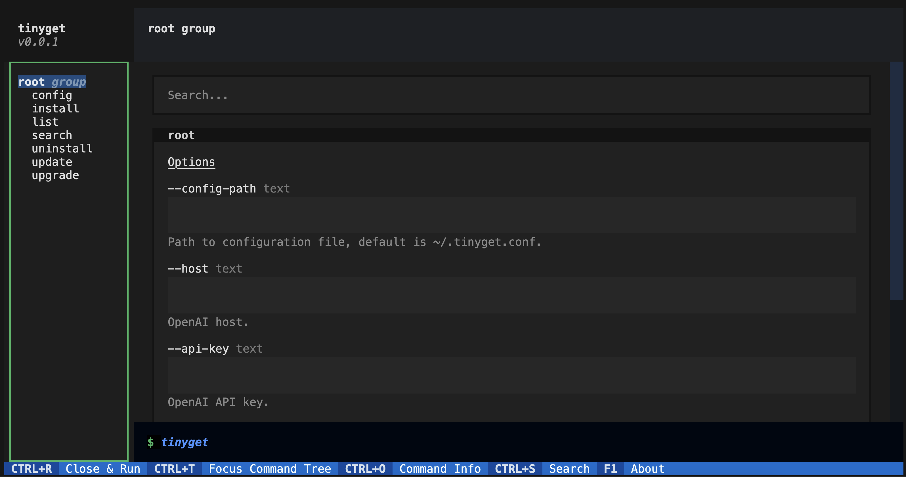

> Corrector: [TinyCorrect](https://gitee.com/tinylab/tinycorrect) v0.2-rc2 - [urls]<br/>
<p align="center">
	</img>
</p>
<p align="center">
    
    
    
    
    
    
</p>

# Tinyget

[中文][003] | English

Tinyget is a Python package management tool designed to encapsulate core operations of various package managers and provide virtual interfaces. This allows operations on them through a unified interface and format, reducing the confusion caused by different software distribution tools. Supports but is not limited to: apt, dnf, pacman, etc.

<details>
  <summary> 🎬 Video Demonstration </summary>

&nbsp;

<a href="https://asciinema.org/a/zxl8AIYaSZIdgDHudjLzuaqH0" target="_blank"></a>

</details>

## Features

- [x] Encapsulates common software operations of multiple package managers, such as install, uninstall, view history, rollback (currently only partially supported), search, and global update.
- [x] Common software source configuration. If you want to configure your own software source, please refer to the [Development Manual][001]。
- [x] Third-party software package support, allowing you to download software packages that ordinary package managers cannot automatically download. If you want to configure your own third-party software, please refer to the [Development Manual][001]。
- [x] Supports I18n. You can switch languages by adding `LANG=en_US` before the command.
- [x] Simulated interface provision. Even under Ubuntu, you can use commands like `dnf`, `pacman` provided by tinyget. We will help you simulate equivalent operations.
- [x] AI auto-correction. Mistyped package names or commands? Let AI help you correct them.
- [ ] Autoupdates.

## Quick Start

### Installation

```bash
pip install git+https://gitee.com/tinylab/tinyget.git
# Or use our specific development version
pip install git+https://gitee.com/tinylab/tinyget.git@ospp-2024
```

```bash
# Update
pip install --upgrade git+https://gitee.com/tinylab/tinyget.git
```

### Usage

```bash
Usage: tinyget [OPTIONS] COMMAND [ARGS]...

Options:
  --config-path TEXT              Path to configuration file, default is
                                  ~/.config/tinyget/config.json
  --debug BOOLEAN                 Enable debug logs
  --live-output / --no-live-output
                                  Real-time stream output
  --host TEXT                     OpenAI host.
  --api-key TEXT                  OpenAI API key.
  --model TEXT                    OpenAI model.
  --max-tokens TEXT               OpenAI max tokens.
  --help                          Show this message and exit.

Commands:
  config          Interactively set up ai_helper for tinyget.
  history         check history
  install         Install packages.
  list            List packages.
  repo_configure  configure repo.
  repo_list       List all available repos in builtin mirror list.
  rollback        rollback to specified history
  search          Search package.
  server          TinyGet Server for GUI
  tui             TinyGet Simple TUI
  uninstall       Uninstall packages.
  update          Update the index of available packages.
  upgrade         Upgrade all available packages.
```

#### Basic Operations

- `tinyget install` Install packages.
- `tinyget uninstall` Uninstall packages.
- `tinyget list` List all available packages.
- `tinyget search` Search for packages.
- `tinyget history` View local package manager operation history.
- `tinyget repo_list` View available software sources.
- `tinyget repo_configure` Configure selected software sources.
- `tinyget rollback` Rollback operations.
- `tinyget update` Update package indexes.
- `tinyget upgrade` Full upgrade.

#### List Packages

```bash
tinyget list --help
Usage: tinyget list [OPTIONS]

  List packages.

Options:
  -I, --installed   Show only installed packages.
  -U, --upgradable  Show only upgradable packages.
  -C, --count       Show count of packages.
  --help            Show this message and exit.
```

#### Configuring AI Assistant

This tool provides an AI intelligent assistant function. When your command has errors, it will automatically correct them for you. You can configure the AI assistant through the config command.

```bash
Usage: tinyget config [OPTIONS]

  Interactively set up ai_helper for tinyget.

Options:
  -H, --host TEXT           openai api host, default is
                            https://api.openai.com, can be specified with
                            environment variable OPENAI_API_HOST
  -K, --api-key TEXT        openai api key, can be specified with environment
                            variable OPENAI_API_KEY
  -M, --model TEXT          model to use, can be specified with environment
                            variable OPENAI_MODEL
  -C, --max-tokens INTEGER  Maximum number of tokens to be generated, default
                            is 1024, can be specified with environment
                            variable OPENAI_MAX_TOKENS, 8192 is openai's max
                            value when using gpt-3.5-turbo
  -R, --repo-paths TEXT     Specify third-party softwares repo paths, default
                            will be softwares' repo/builtin dir. Can be
                            specified multiple times
  --help                    Show this message and exit.
```

#### TUI Interface

Use the `tinyget tui` command to launch the TUI interface.



## Security Statement

Tinyget by default invokes system package managers and official package build programs to perform software updates, installations, and other operations, without calling additional executables.

## Disclaimer

For commercial software in third-party packages, their intellectual property rights belong to each commercial company. Tinyget only provides official download links and downloads and installs from these links without modifications in principle.

## Thanks to

- [MirrorZ Project][002]

## TODO List

- [ ] When performing update, automatically update third-party software package configurations if available.
- [ ] Installation self-check (tinyget --init/test) function to test whether dependencies or configuration issues are missing after installation.
- [ ] Use async/multiprocessing to improve parsing performance.
- [ ] Improve rollback functionality.
- [ ] Automatic release.
- [ ] Enhance the user experience of the AI assistant.
- [ ] Also provide operation records of Tinyget itself.
- [ ] Support more translation languages.
- [ ] Provide functionality similar to `rpm -ql` to list which files are installed by a package.

[001]: docs/Development.md
[002]: https://mirrorz.org
[003]: README.md
