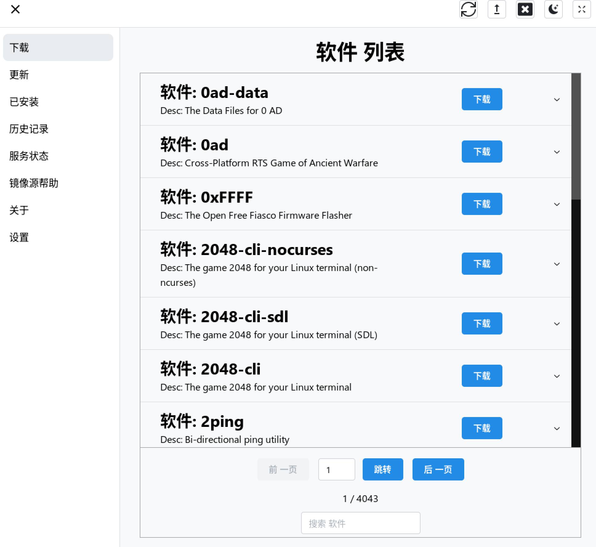
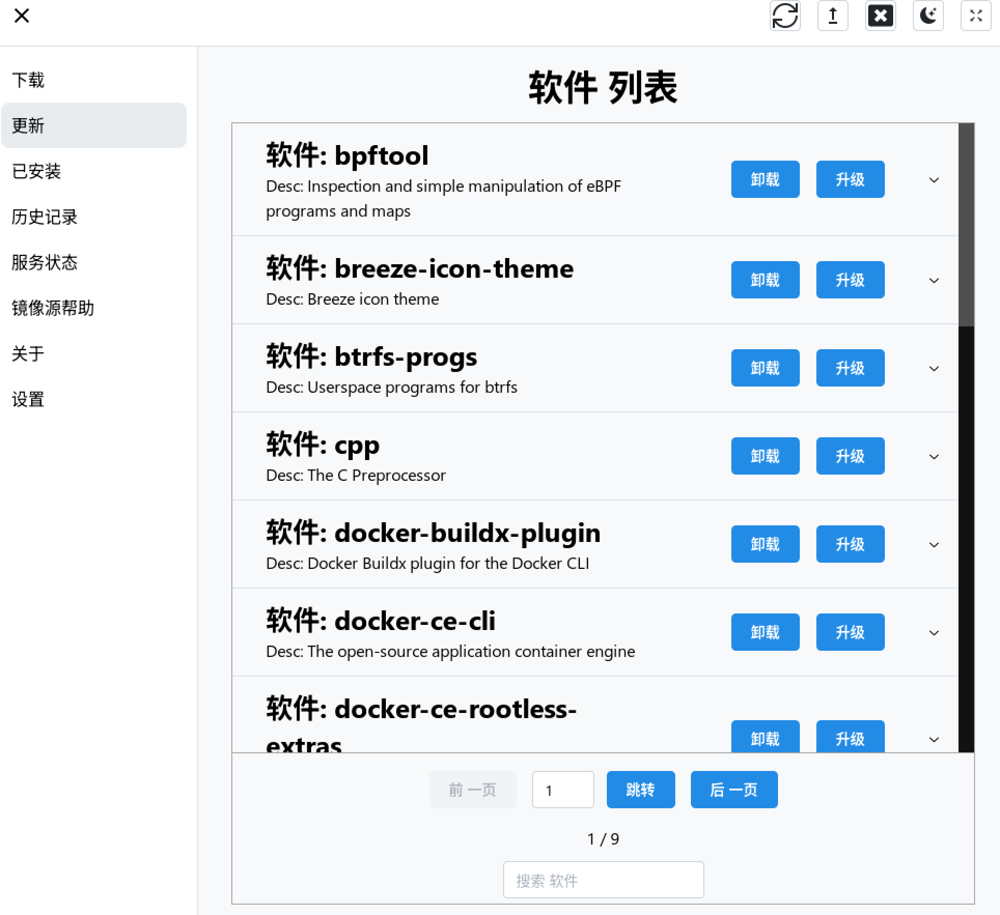
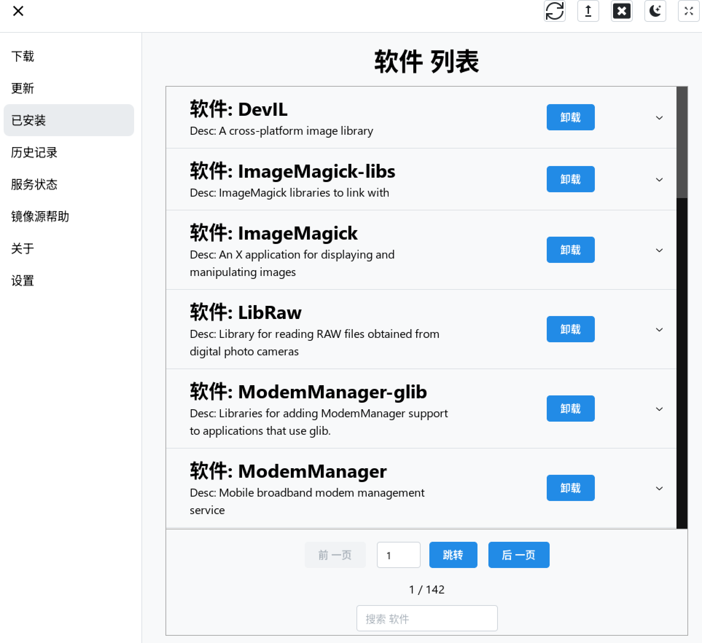
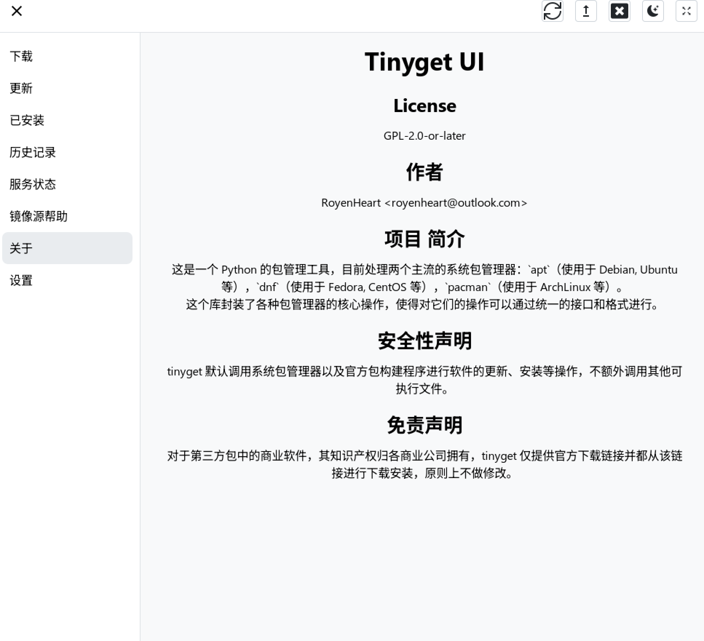
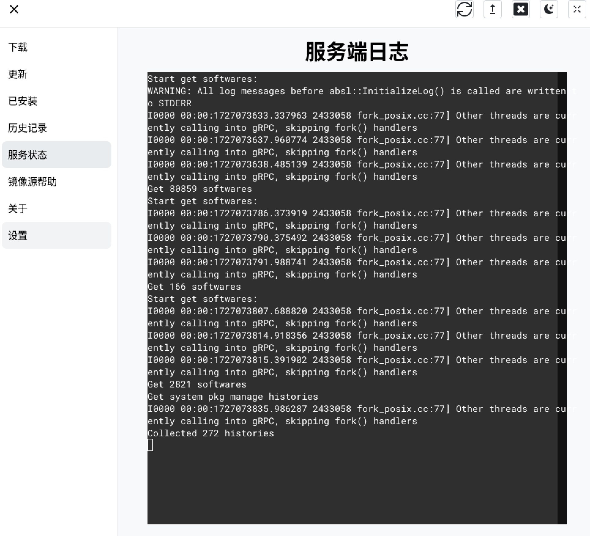
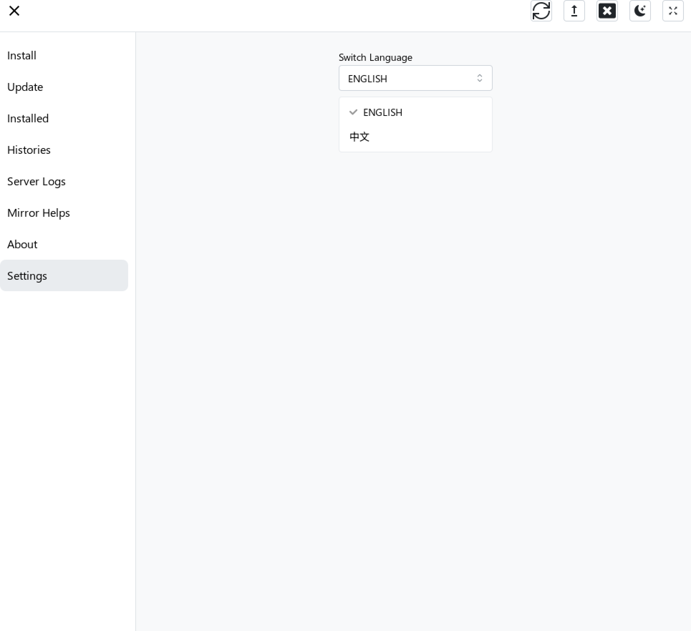
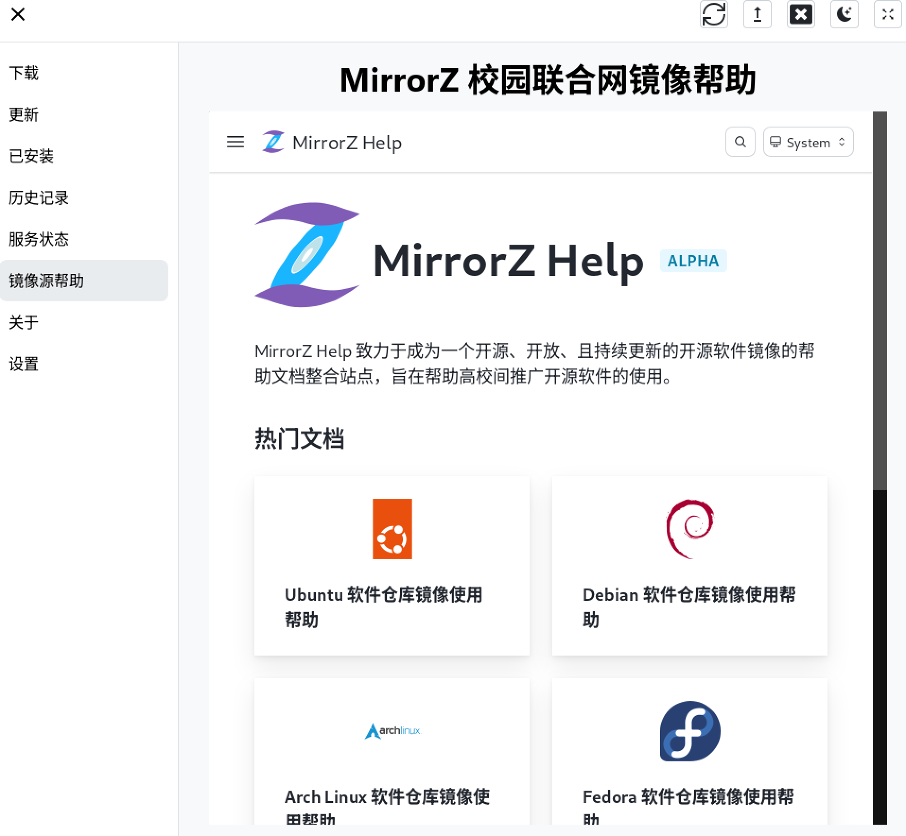
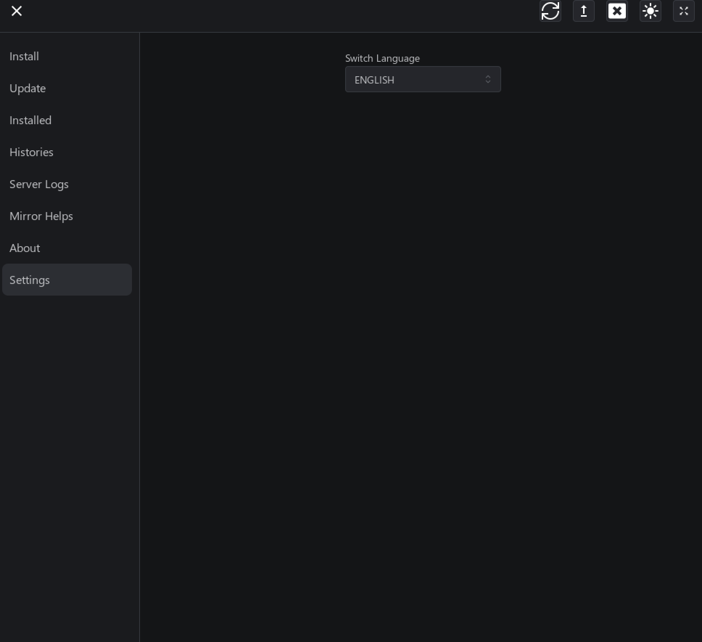

> Corrector: [TinyCorrect](https://gitee.com/tinylab/tinycorrect) v0.2-rc2 - [spaces toc urls autocorrect]<br/>

# Tinyget GUI 开发路线

- [项目仓库][004]

主要技术栈：

1. [Tauri App 框架（Rust 后端 + JS 前端）][015]
2. [React JS 组件库][011]
3. [React Icons 图标库][013]
4. [Mantine UI 组件][010]
5. [Mantine 默认主题][007]
6. [Vite 前端构建工具][002]
7. [react-i18next 前端 I18n 组件][012]
8. [prost Rust protocal buffers 实现][008]
9. [tonic gRPC C/S][006]
10. [portable_pty 跨平台虚拟终端][003]

[演示视频][014]

主要功能均已完成，仍需要一些额外的性能优化和用户交互的细微调整。

## 调研

在包管理器图形 GUI 上有一些类似软件：

1. [KDE Discover][001]，KDE 软件商店，基于 Qt 开发（C/C++），在 KDE 桌面环境中使用。
2. Spark Store，星火应用商店，基于 Qt 开发。针对 Debian 系发行版的应用商店。

但这些软件也只有 GUI 界面提供，并没有类似 tinyget 这样封装了多种包管理器且同时提供了 CLI 的软件。

为了编写 tinyget 的图形化界面，我首先调研了几种主流的软件库：

### textualize

- [textual 代码仓库][017]
- [textual 推荐介绍][009]
- [textual 官方文档][016]

生成 TUI 界面，在 GitHub 有超过 20k 的 stars，更新频率高，社区活跃。自带 log 日志、协程并发、单元测试等功能，容易上手和进行开发。

缺点是无法直接显示图片，更偏向命令行界面，对于新手上手难度较高，并不适合初学者，因此并不进行考虑。

### PyQt5

Qt 图形框架的 Python 版本，Qt 本身有商业版和开源版（基于 GPL/LGPL 许可证），Tinyget 项目也是基于 GPL 2.0 许可证，因此可以制作应用。不过相比一些更现代的基于 HTML、CSS、JS 工作流程的图形框架，PyQt 要制作比较现代的界面比较繁琐，也没有很多现有的模板，遂放弃。

### Tauri

新型图形框架，Rust 后端 + JS 前端。使用 Rust 作为后端，性能好。同时前端是基于 HTML、CSS、JS 的工作流程，套上 React JS、Mantine 组建库可以比较方便地开发出比较美观易用的界面。缺点是生态比较新，一些已有组件的兼容性有潜在的不足。

Tauri 由一个可搭配任何前端来构建桌面应用的框架（Vite）和 Rust 核心构成。每个应用均由两个部分组成：

- 创建窗口并向其提供原生功能支持的 Rust 二进制文件（后端）。
- 由您选择的前端框架，用于编写窗口内的用户界面（前端）。

### 开发准备

通过调研，我最终选取了 tauri 作为本次 GUI 开发的框架，采用 Vite 前端构建工具 + React UI 模板 + JavaScript 语言编写前端 + pnpm 管理前端组件 + Rust 后端。前后端技术，比较容易制作现代美观的界面，同时 Rust 后端能一定程度上保障性能。Tauri 同时也是跨平台图形框架，后续若需要进行 Windows 平台上 winget 等包管理器的支持，可以很方便地进行适配。基础模板使用了开源的 [modern desktop App template][005]。

一个基本的开发环境搭建：

```bash
sudo apt update
sudo apt install libwebkit2gtk-4.0-dev \
    build-essential \
    curl \
    wget \
    libssl-dev \
    libgtk-3-dev \
    libayatana-appindicator3-dev \
    librsvg2-dev
rustup update
cargo install create-tauri-app --locked
# 创建项目，可以选择前后端框架，自动创建项目结构
cargo create-tauri-app
# 安装 tauri 的管理 CLI 接口，用于构建，管理项目等
cargo install tauri-cli
# 使用刚安装的 tauri cli 结构构建项目（development 模式）
cargo tauri dev
```

## 项目结构

项目推荐使用 VSCode 进行开发，并安装 `.vscode/extensions.json` 中推荐的代码静态分析、格式化等插件。

同时在 `.vscode/launch.json` 和 `.vscode/tasks.json` 中也定义了 vscode 调试任务，可以比较方便地进行代码调试。

在 `.github` 中规定了 issues 格式和 CI/CD 配置，在后续的迭代中可以使用 GitHub 或等效工具在容器中自动构建并分发。

主要文件和模块：

- src-tauri -- Rust 后端代码目录
  - icons -- 后端 Logo 文件，用于系统托盘图标
  - protos -- gRPC 配置文件和自动生成的代码
  - src -- Rust 后端源代码
    - main.rs -- 后端主入口
    - sys_tray.rs -- 实现系统托盘的代码
    - src/tinyget -- 与 tinyget 通信的代码模块
      - get.rs -- 软件搜索与 list 实现
      - history.rs -- 历史记录查看实现
      - install.rs -- 软件下载实现
      - log.rs -- 服务端启动、健康检查、日志截获实现
      - uninstall.rs -- 软件卸载实现
      - update.rs -- 软件更新实现
- src -- 前端代码目录
  - App.jsx -- 主组件入口
  - env.js -- 定义前端全局变量
  - components -- 功能组件模块
  - tauri -- 其他功能组件模块
  - translations -- I18n 翻译文件
  - views -- 导航栏视图模块
- public -- 公共文件（包括 Logo、网页元信息等）
- package.json -- 前端依赖声明
- .prettierrc -- 代码格式化标准
- index.html

模块结构和交互：

```
┌─────────────────────────────────────────┐
│GUI ReactJS Frontend                     │
│┌──────────────────────────────────────┐ │
││Render Pages                          │ │
││                 invoke com1 com2 ... │ │
│└───────────────────┬▲───┬▲────┬▲──────┘ │
└────────────────────┼┼───┼┼────┼┼────────┘
┌────────────────────┼┼───┼┼────┼┼────────┐
│GUI Rust Backend    ││   ││    ││        │
│                   ┌▼└───▼└────▼└──────┐ │
│┌─────────────┐    │Command Submitter  │ │
││Start,Restart│    │                   │ │
││Health Check │    │ Install History ..│ │
│└──┬───▲──────┘    └──┬──▲────┬─▲──────┘ │
└───┼───┼──────────────┼──┼────┼─┼────────┘
┌───┼───┼──────────────┼──┼────┼─┼────────┐
│   │   │              │  │    │ │        │gRPC middleWare
└───┼───┼──────────────┼──┼────┼─┼────────┘
┌───▼───┴──────────────┼──┼────┼─┼────────┐
│                   ┌──▼──┴────▼─┴──────┐ │
│                   │                   │ │
│    Tinyget Server │    Server Thread  │ │
│                   │                   │ │
│                   └───────────────────┘ │
└───▲────┬────────▲───┬─────────▲───┬─────┘
    │    │        │   │         │   │
┌───┴────▼────┐┌──┴───▼─────┐┌──┴───▼─────┐
│             ││            ││            │
│ DNF         ││ APT        ││ PACMAN     │
│             ││            ││            │
└─────────────┘└────────────┘└────────────┘
```

- GUI Rust Backend -- 当 App 启动时，Rust 后端启动 tinyget 并定时检查 tinyget 服务是否存活（通过进程是否退出、gRPC 服务能否连接的方式），若检查到 tinyget 服务已死亡，便通过 tauri 的事件触发方式提示前端并触发重新渲染，同时 Rust 后端尝试重启，在服务未成功启动前端功能将禁用。同时可以接受前端的用户请求，将相对应的用户命令解析通过 gRPC 发送给 Tinyget Server Thread，得到响应解析返回给前端
- Tinyget Server Thread -- 通过一个独立的线程启动服务，包括接受 gRPC 中间件的请求并处理、调用包管理器执行任务等。
- GUI ReactJS Frontend -- 渲染组建，接受用户输入解析转换为对应的任务提交给 Rust 后端，得到响应后再进行转换渲染展现给用户。

## 主要功能

### 基本软件操作

<center>  <br> <div style="color:orange; border-bottom: 1px solid #d9d9d9; display: inline-block; color: #999; padding: 2px;margin-bottom:1em">显示所有软件并提供按钮进行下载、卸载和升级</div> </center>

<center>  <br> <div style="color:orange; border-bottom: 1px solid #d9d9d9; display: inline-block; color: #999; padding: 2px;margin-bottom:1em">显示所有可更新软件并提供按钮进行升级</div> </center>

<center>  <br> <div style="color:orange; border-bottom: 1px solid #d9d9d9; display: inline-block; color: #999; padding: 2px;margin-bottom:1em">显示所有已安装软件并提供按钮进行卸载和升级</div> </center>

<center>  <br> <div style="color:orange; border-bottom: 1px solid #d9d9d9; display: inline-block; color: #999; padding: 2px;margin-bottom:1em">关于界面</div> </center>

### gRPC 信息传输

GUI 界面需要和 tinyget 服务端（通过 CLI 界面 `tinyget server` 启动）。我们定义了必要的信息，并通过 async 异步方式进行 C/S 信息传输来实现应用的下载、状态更新等。

```protobuf
syntax = "proto3";

package tinyget_grpc;

service TinygetGRPC {
    rpc SoftsGet(SoftsResquest) returns (SoftsResp);
    rpc SoftsGetStream(SoftsResquest) returns (stream Package);
    rpc SoftsGetBidiStream(stream SoftsResquest) returns (stream Package);
    rpc SoftsInstall(SoftsInstallRequests) returns (SoftsInstallResp);
    rpc SoftsInstallStream(SoftsInstallRequests) returns (stream SoftsInstallResp);
    rpc SoftsInstallBidiStream(stream SoftsInstallRequests) returns (stream SoftsInstallResp);
    rpc SoftsUninstall(SoftsUninstallRequests) returns (SoftsUninstallResp);
    rpc SoftsUninstallStream(SoftsUninstallRequests) returns (stream SoftsUninstallResp);
    rpc SoftsUninstallBidiStream(stream SoftsUninstallRequests) returns (stream SoftsUninstallResp);
    rpc SysUpdate(SysUpdateRequest) returns (SysUpdateResp);
    rpc SysUpdateStream(SysUpdateRequest) returns (stream SysUpdateResp);
    rpc SysUpdateBidiStream(stream SysUpdateRequest) returns (stream SysUpdateResp);
    rpc SysHistory(SysHistoryRequest) returns (SysHistoryResp);
    rpc SysHistoryStream(SysHistoryRequest) returns (stream History);
    rpc SysHistoryBidiStream(stream SysHistoryRequest) returns (stream History);
}

message SoftsResquest {
    optional string pkgs = 1;
    bool only_installed = 2;
    bool only_upgradable = 3;
}

message SoftsInstallRequests {
    repeated string pkgs = 1;
}

message SoftsUninstallRequests {
    repeated string pkgs = 1;
}

message SysUpdateRequest {
    bool upgrade = 1;
}

message SysHistoryRequest {}

message Package {
    string package_name = 1;
    string architecture = 2;
    string description = 3;
    string version = 4;
    bool installed = 5;
    bool automatically_installed = 6;
    bool upgradable = 7;
    optional string available_version = 8;
    repeated string repo = 9;
}

message History {
    string id = 1;
    string command = 2;
    string date = 3;
    repeated string operations = 4;
}

message SoftsResp {
    repeated Package softs = 1;
}

message SysHistoryResp {
    repeated History histories = 1;
}

message SoftsInstallResp {
    uint32 retcode = 1;
    optional string stdout = 2;
    optional string stderr = 3;
}

message SoftsUninstallResp {
    uint32 retcode = 1;
    optional string stdout = 2;
    optional string stderr = 3;
}

message SysUpdateResp {
    uint32 retcode = 1;
    optional string stdout = 2;
    optional string stderr = 3;
}
```

### 服务端日志

为了确保在 GUI 启动时，tinyget 服务端也能起来为其提供服务，同时 GUI 也需要获取其日志输出方便用户、开发者定位问题和调试，我设计并使用 tauri invoke，tauri 事件触发机制和 rust portable_pty 库的虚拟终端能力实现了服务端自动启动、健康检查、日志截取反馈功能。

<center>  <br> <div style="color:orange; border-bottom: 1px solid #d9d9d9; display: inline-block; color: #999; padding: 2px;margin-bottom:1em">显示服务端日志</div> </center>

### I18n

Tinyget GUI 的前端支持语言的切换，通过 `react-I18n-next` 库的支持，只需要修改简单几行 JSON 代码（在 `src/translations` 中）便可以实现。在设置界面中进行实时的切换：

<center>  <br> <div style="color:orange; border-bottom: 1px solid #d9d9d9; display: inline-block; color: #999; padding: 2px;margin-bottom:1em">语言切换</div> </center>

### 镜像源帮助

很多用户可能需要镜像源的帮助来提升软件下载、安装速度或安装特定软件。由于各类软件分发的复杂性以及处于对系统安全的考虑，tinyget 实现的镜像源配置并非完全自动而是生成配置的可执行文件让用户自行评估风险并运，因此 tinyget ui 中仅内嵌了 MirrorZ 校园网联合镜像的帮助界面：

<center>  <br> <div style="color:orange; border-bottom: 1px solid #d9d9d9; display: inline-block; color: #999; padding: 2px;margin-bottom:1em">借用 MirrorZ Project 展示镜像源帮助</div> </center>

### 用户交互

此外，为提升易用性，GUI 界面还实现了一些额外的功能：

<center>  <br> <div style="color:orange; border-bottom: 1px solid #d9d9d9; display: inline-block; color: #999; padding: 2px;margin-bottom:1em">暗色、亮色模式切换</div> </center>

暗色模式有助于保护在夜晚工作的人的视力。

[001]: https://apps.kde.org/zh-cn/discover/
[002]: https://cn.vitejs.dev/guide/
[003]: https://docs.rs/portable-pty/latest/portable_pty/
[004]: https://gitee.com/royenheart/tinyget-ui
[005]: https://github.com/elibroftw/modern-desktop-app-template
[006]: https://github.com/hyperium/tonic
[007]: https://github.com/mantinedev/mantine/blob/master/src/mantine-styles/src/theme/default-theme.ts
[008]: https://github.com/tokio-rs/prost
[009]: https://linux.cn/article-16557-1.html
[010]: https://mantine.dev/
[011]: https://react.dev/
[012]: https://react.i18next.com/latest/trans-component
[013]: https://react-icons.github.io/react-icons
[014]: https://royenheart.com/c/tget
[015]: https://tauri.app/
[016]: https://textual.textualize.io/
[017]: https://www.textualize.io/
