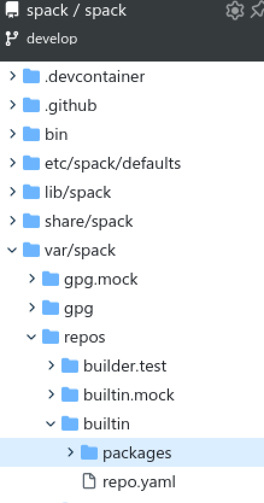
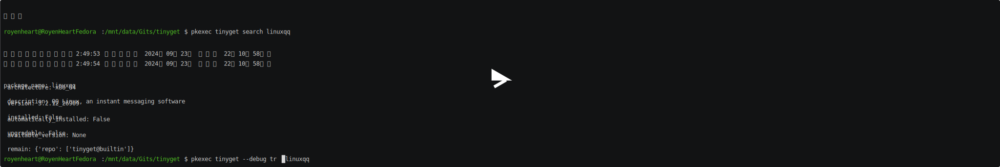

> Corrector: [TinyCorrect](https://gitee.com/tinylab/tinycorrect) v0.2-rc2 - [urls pangu autocorrect]<br/>

# 第三方软件包开发路线

## 问题产生

很多国产软件例如 QQ 等并不提供软件源，仍然通过传统的官网文件分发方式，而现有的包管理器，包括图形界面的软件管理器并不能很好地支持（因为其分发过程本身就是残缺不完善的）。

## 关于常用国产 Linux 软件包发布方式的分析

很多国产软件在不同发行版甚至同一发行版上都有不同的选择。比如 WeChat 的 UOS 版就被打包至 AUR 以及被制作成 Flatpak 进行分发。这些国产软件的下载安装也有一些相关的解决方案，其中也有图形软件管理器：

1. [铜豌豆软件源][001]，主要是收集了很多国产软件（来自不同渠道）制作镜像站分发。
2. [Spark Store 应用商店][007]，Debian 系发行版的应用商店，常用于 Deepin 等国产 Linux 发行版中。[图形化应用商店程序源代码][004]。收集了 Wechat 等软件。
3. UOS、Ubuntu Kylin 等国产 Linux 发行版的应用商店。UOS 收录的国产软件在 Deepin 也可以使用。
4. [Ubuntu Kylin 镜像源][006]
5. [Deepin 镜像源][003]。收录了 WeChat、QQ 等软件。

但这些方案知名度不算高，也很难在主流 Linux 发行版中使用。

### 主要国产软件发布方式的异同

#### 微信

- [x] Deepin、UOS、Ubuntu Kylin 收录
- [x] 铜豌豆收录
- [ ] 官方下载地址

官方只在 UOS 上发布了原生版本，在 Deepin、UOS 应用商店和软件镜像源中有收录。有一些第三方从 UOS 上获取了软件包发布在 AUR、flatpak 上。也可以用 Wine 运行，还有 Docker+Wine 的套壳版本。

包名：com.qq.weixin.deepin（Deepin 特供）/com.tencent.wechat（UOS 原生正式版，铜豌豆也有收录）/com.tencent.WeChat（flatpak）/wechat-universal-bwrap（AUR）/'zixia/wechat'（Docker+Wine）
版权所有：腾讯公司
下载地址：https://weixin.qq.com/

#### QQ

- [x] Deepin、UOS、Ubuntu Kylin 收录
- [x] 铜豌豆收录
- [x] 官方下载地址

官方提供下载，收录在 Deepin、UOS 的应用商店和软件镜像源中。Deepin 的软件包和官方提供的包名/版本上有些许差别。

包名：linuxqq/linux.qq.com（Deepin）
版权所有：腾讯公司
支持包格式：deb、rpm、AppImage
支持架构：amd64、arm64、mips64el（只有 deb）、loongarch64（只有 deb）
下载地址：https://im.qq.com/linuxqq/index.shtml

#### 网易云音乐

- [x] Deepin、UOS、Ubuntu Kylin 收录
- [x] 铜豌豆收录
- [ ] 官方下载地址
- [x] Wine

官方曾经提供下载，目前下载链接已经隐藏，在 Deepin、UOS 应用商店和软件镜像源中有收录，但是很久没更新。有很多第三方客户端，包括 yesplaymusic 等，这些第三方软件包部分有在 snap、flatpak 上发布。

包名：electron-netease-cloud-music（第三方）/netease-cloud-music-gtk（第三方）/yesplaymusic（第三方）/netease-cloud-music（官方，铜豌豆）/com.163.music（官方，Deepin）
官方软件包版权所有：网易公司
下载地址：https://music.163.com/#/download（Wine）

#### WPS Linux

- [x] Deepin、UOS、Ubuntu Kylin 收录
- [x] 铜豌豆收录
- [x] 官方下载地址

官方提供下载，收录在 Deepin、UOS 的应用商店和软件镜像源中。Deepin 的软件包和官方提供的包名/版本上有些许差别。

包名：wps-office/cn.wps.wps-office（Deepin）
版权所有：北京金山办公软件股份有限公司
支持包格式：deb、rpm
支持架构：amd64、arm64、mips64el、loongarch64（只有 deb）
下载地址：https://linux.wps.cn

#### 钉钉

- [x] Deepin、UOS、Ubuntu Kylin 收录
- [x] 铜豌豆收录
- [x] 官方下载地址

官方提供下载，收录在 Deepin、UOS 的应用商店和软件镜像源中，各个发布源均一致。

包名：com.alibabainc.dingtalk
版权所有：钉钉科技有限公司
支持包格式：deb
支持架构：amd64、arm64、mips64el、loongarch64
下载地址：https://page.dingtalk.com/wow/z/dingtalk/simple/ddhomedownload#/

#### 百度网盘

- [x] Deepin、UOS、Ubuntu Kylin 收录
- [x] 铜豌豆收录
- [x] 官方下载地址

官方提供下载，收录在 Deepin、UOS 的应用商店和软件镜像源中，各个发布源均一致。

包名：com.baidu.baidunetdisk
版权所有：百度（中国）有限公司
支持包格式：deb、rpm
支持架构：amd64、arm64
下载地址：https://pan.baidu.com/download#Linux

### 总结

为了实现对国产软件的下载安装，并留出合适的设计冗余以便后续扩展到第三方软件包（即下载安装管理由于本身分发过程的不完善或者不兼容导致无法进行的软件包），有几种可选的方案：

1. 自建镜像源，对系统状态影响小，但需要持续维护。
2. 参考 [spack][005]，为每个国产软件写好配置文件，和软件本体一起进行版本控制，所有人都可参加软件安装配置的修改。

现有的铜豌豆项目并不被考虑，首先是第三方项目，我们并不可控，其次其软件源的配置可能会影响当前用户系统的状态。

同时，第三方软件很多都是商业软件，并不允许第三方分发或者重新打包，且制作镜像源等需要额外的服务。最终，tinyget 目前使用第二种方案。

`spack` 第三方软件包支持的目录结构如下：



其中，`var/spack/repos/builtin` 目录存放了第三方软件包的配置文件，其中一个标准的配置文件（python）类似如下：

```python
import glob
import os
import platform
import re
import shutil

from spack.package import *

class _xxx(SourceforgePackage, Package):

    homepage = "xxx"
    sourceforge_mirror_path = "xxx"
    tags = ["windows"]

    executables = ["xxxx"]

    license("XXX")

    version("xxx", sha256="xxx")

    depends_on("c", type="build")

    variant(
        "link_type",
        default="shared",
        description="build shared and/or static libraries",
        values=("static", "shared"),
        multi=True,
    )

    phases = ["build", "install"]

    conflicts("platform=linux")

    patch("noexcept_typedef.patch", when="platform=windows")

    def determine_version(cls, exe):
        output = Executable(exe)("--help", output=str, error=str)
        match = re.search(r"xxx ([xx][xxx]*.[xxx][0-9])", output)
        return match.group(1) if match else None

    def url_version(self, version):
        return "xxx"

    def plat_arch(self):
        arch = platform.machine()
        if arch.lower() == "amd64":
            arch = "x64"
        # elif ...
        return arch

    def is_64bit(self):
        return "64" in str(self.pkg.spec.target.family)

    def build(self, spec, prefix):
        link_type = "1" if "static" in spec.variants["link_type"].value else "0"
        nmake_args = [
            f"PLATFORM={self.plat_arch}",
            f"MY_STATIC_LINK={link_type}",
            "NEW_COMPILER=1",
        ]
        os.environ.pop("CC", None)
        with working_dir(self._7z_src_dir):
            nmake(*nmake_args)

    def install(self, spec, prefix):
        arch_prefix = "x64" if self.is_64bit() else "x86"
        path_roots = ["Bundles", "UI"]
        exts = ["*.exe", "*.dll"]
        with working_dir(self._7z_src_dir):
            for root in path_roots:
                # get packages ....
```

这其中定义了软件包的元信息（比如下载地址，版本、作者等），基于 spack 软件的方法和基类实现了各种下载、安装、构建方法。tinyget 目前第三方软件包支持也参考此种结构。

## Tinyget 第三方软件包支持

tinyget 内置的第三方软件仓库位于 `tinyget/repos/builtin/packages` 下，所有人可以向社区发起 PR 合入自己的第三方软件配置，也可以安装后进入对应位置进行修改，tinyget 会在运行时动态导入（通过 python 的 importlib 模块）。同时，我们也参考 spack 设计可以在 `tinyget` 配置文件中修改要进行搜索的软件仓库位置，目录结构和内置仓库相同即可。

这里以 QQ 为例，在 `packages/QQ` 目录下创建 `package.py` 文件，引入必要的 tinyget 模块并从 `third_party.py` 继承抽象基类 `ThirdPartySofts`，实现思路如下：

```python
# ......
from tinyget.package import ManagerType, Package
from tinyget.repos.third_party import ThirdPartySofts, download_file, AllPkgInfo
from tinyget.wrappers import MANAGER
from tinyget.globals import ARCH, SupportArchs
from tinyget.wrappers import PackageManager
from tinyget.common_utils import logger
# tinyget 会尽可能提供接口满足第三方软件安装需求，尽量只使用 python 原生接口和 tinyget 接口，防止动态导入时无法使用未被安装的模块。
# 若需要的接口功能 tinyget 并没有实现，让用户提出 issue 并去实现。

class _QQ(ThirdPartySofts):

    HOMEPAGE = "xxx"
    VERSION = "xxxx"
    DOWNLOAD_PAGE = "xxx"
    PKG_NAME = AllPkgInfo.LINUXQQ

    @property
    def is_support(self) -> bool:
        # xxx，判断 QQ 在当前系统下是否支持。对于 QQ，需要查看官网提供的安装包，并编写对应的逻辑。
        if (
            (MANAGER == ManagerType.dnf and ARCH == SupportArchs.arm64)
            or (MANAGER == ManagerType.dnf and ARCH == SupportArchs.x86_64)
            # ......
        ):
            return True
        elif MANAGER == ManagerType.apt and ARCH == SupportArchs.x86_64:
            return True
        # elif ......
        else:
            return False

    def url(self) -> Optional[str]:
        # 因为 QQ 没有提供软件源，只能从官网下载得到安装包，然后进行安装
        # 由于嵌入到了各个包管理器封装的搜索逻辑中，只要包管理器支持本地安装，那么直接提供下载的安装包位置就可以进行安装
        # 可以使用 tinyget 提供的 download_file 或者包管理器的 build 服务下载或者构建软件包。
        tmpdir = tempfile.mkdtemp()
        if (
            (MANAGER == ManagerType.dnf and ARCH == SupportArchs.arm64)
            or (MANAGER == ManagerType.dnf and ARCH == SupportArchs.x86_64)
            # ......
        ):
            n = f"{_QQ.PKG_NAME}_{_QQ.VERSION.replace('_', '-')}_{ARCH}.{MANAGER.ext}"
            url = f"{_QQ.DOWNLOAD_PAGE}/{n}"
            downloads = os.path.join(tmpdir, n)
            download_file(url=url, output_file=downloads)
            return downloads
        elif MANAGER == ManagerType.apt and ARCH == SupportArchs.x86_64:
            # pacman 需要额外进行构建
            return pacman.build(folder=tmpdir)
        # elif ......
        else:
            return None

    def get_pkg_url(self) -> Optional[str]:
        return self.url()

    def get_package(
        self, wrapper_softs: Optional[List[Package]] = []
    ) -> Optional[Package]:
        if not self.is_support:
            return None

        # 和普通包管理器得到的软件列别进行对比，更新软件包信息
        if wrapper_softs is not None:
            for p in wrapper_softs:
                if p.package_name == _QQ.PKG_NAME and p.installed is True:
                    # ......

        return Package(
            package_type=MANAGER,
            package_name=_QQ.PKG_NAME,
            # ......
        )
```

添加完成后若有向 tinyget 提出 PR 合入配置的需求，需要参与的开发者在 `tinyget/repos/third_party.py` 中的 `AllPkgInfo` 组中注册软件包的信息：

```python
@unique
class AllPkgInfo(str, Enum):
    LINUXQQ = "linuxqq"
    # YouPackageEnumName = "YourPackageName"
```

在实现基类时，也使用 AllPkgInfo Enum 结构标识软件包的类（目前使用 `PKG_NAME = AllPkgInfo.LINUXQQ` 的方式）。这样的目的是提升安全性。tinyget 可能在后续的更新中会加强这一方面的检测，防止恶意软件包的植入。

演示效果：

[][002]

可以正常卸载、安装、搜索到 linuxqq。

[001]: https://apt.atzlinux.com/atzlinux
[002]: https://asciinema.org/a/677246
[003]: https://community-packages.deepin.com/deepin/
[004]: https://gitee.com/spark-store-project/spark-store
[005]: https://github.com/spack/spack
[006]: https://mirror.lzu.edu.cn/ubuntukylin/
[007]: https://spark-app.store/
